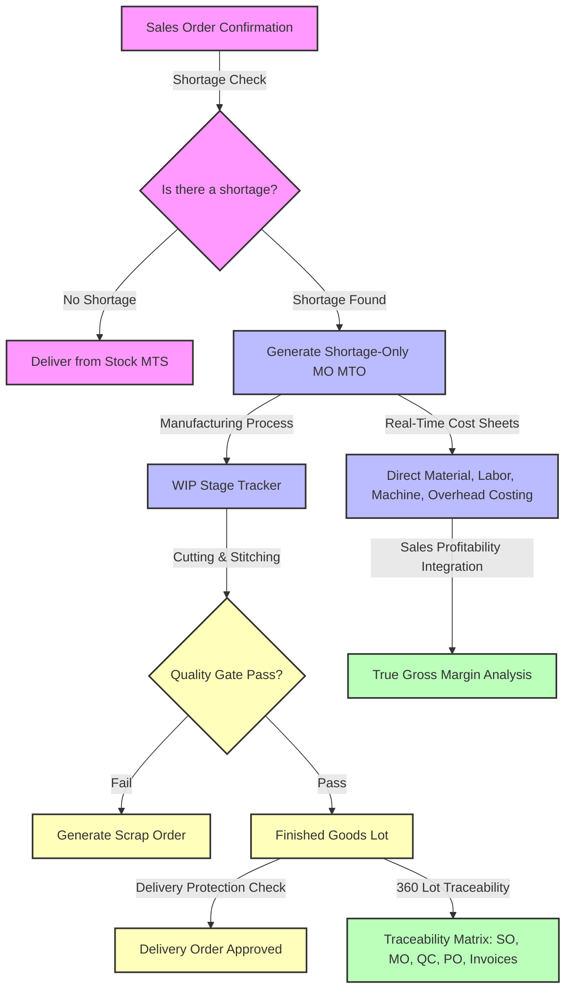

# 🧵 Textile ERP Suite for Odoo 18 Community

[](https://www.odoo.com/)
[](https://www.python.org/)
[](https://www.postgresql.org/)
[](https://github.com/odoo/owl)
[](https://www.gnu.org/licenses/lgpl-3.0.html)

A comprehensive, production-grade suite of custom Odoo 18 modules tailored specifically for the textile and garment manufacturing industry. This suite extends standard Odoo capabilities in **Sales, Manufacturing (MRP), Quality Control, Interactive Dashboards, and Financial Accounting** to support fabric-specific workflows, shortage-based production, rigorous quality locks, and detailed yield/profitability tracking.

---

## 📐 System Architecture & Workflow

The modules are built with a highly decoupled, modular design pattern. They interact seamlessly to form an integrated textile manufacturing and accounting ecosystem:



---

## 📦 Custom Modules Overview

### 1. 🛍️ Textile Sales (`textile_sales`)
Implements **Shortage-Based Manufacturing** to prevent overproduction and optimize stock levels:
- **Shortage Check**: On confirming a Sales Order (SO), the module dynamically calculates the stock shortage (`ordered quantity - available stock`).
- **Shortage-Only MO**: Creates or updates Manufacturing Orders (MOs) *only* for the shortfall quantity.
- **Stock Reservation**: If stock is fully available, it cancels/deletes the draft MO and routes reservations directly from warehouse stock (`make_to_stock`).

### 2. 🧵 Textile MRP (`textile_mrp`)
Enables fabric-specific tracking, waste estimation, and material costing:
- **Textile Cost Buckets**: Maps product categories to specific material classifications (`fabric`, `thread`, `accessories`, `packaging`).
- **Yield & Consumption**: Tracks `Issued Fabric`, `Consumed Fabric`, `Returned Fabric`, and `Waste %` dynamically using Scrap Orders.
- **Routing & Workcenter Costing**: Automatically calculates direct Labor and Machine costs by matching workorder runtimes with workcenter hourly rates.
- **WIP Stage Tracker**: A live, visual progress bar showing quantities currently routing through *Cutting, Stitching, Quality, and Packing*.

### 3. 🛡️ Textile Quality (`textile_quality`)
Enforces strict quality inspection checkpoints and guards manufacturing completion:
- **Inspections & Defect Tracking**: Conducts checks on Stitching, Measurement, and Finishing with automatic scrap order creation for defective units.
- **Operation Gates**: Prevents workorders from finishing and MOs from validation unless a Final Quality Inspection is recorded and marked as **Pass**.
- **Delivery Protection**: Blocks the validation of Outgoing Deliveries if the linked manufacturing lot failed inspection or has no inspection records.
- **Automatic Lot Inheritance**: Automates raw material trace lines by copying component Lot numbers to the MO raw materials list upon internal picking validation.

### 4. 📊 Textile Dashboard (`textile_dashboard`)
A custom management control screen built on Odoo's OWL framework:
- **KPI Dashboards**: Highlights metrics across Sales, Purchases, Inventory, Quality Checks, and Invoicing.
- **WIP Analytics**: Shows real-time counts of products currently in Cutting, Stitching, Quality Control, and Finished Goods locations.

### 5. 💰 Textile Accounting (`textile_accounting`)
Integrates operational costs directly into the financial ledger:
- **Cost Sheets**: Compiles comprehensive Material, Labor, Machine, and Overhead expenses on Manufacturing Orders.
- **Sales Profitability**: Overrides native Odoo Cost (`purchase_price`) fields on Sales Order lines to dynamically fetch actual MO costs, Purchase Order costs, or Vendor Pricelist (`product.supplierinfo`) entries.
- **Analytics Dashboards**: Visualizes Product Profitability and Customer Profitability margins.
- **360-Degree Lot Traceability**: A comprehensive grid on the Lot/Serial form linking the Lot to all its related MOs, SOs, Pickings, Quality Checks, and Invoices.

### 📋 Textile WIP Inventory Report (`textile_inventory_report`)
- **Stage-Wise Reporting**: A dedicated reporting interface showing product quantities currently residing in each manufacturing stage or work center location.
- **WIP Valuation**: Assists production planners in tracking work-in-progress values across different production lines.

---

## 🛠️ Tech Stack & Dependencies

| Layer | Technology / Module |
| :--- | :--- |
| **Backend** | Python 3.10+, PostgreSQL |
| **Frontend / UI** | JS (ES6+), XML, OWL Framework (Odoo Web Library) |
| **Odoo Framework** | Odoo 18.0 Community / Enterprise |
| **Core Dependencies** | `sale_management`, `mrp`, `stock`, `purchase`, `account` |
| **Community Addons** | `om_account_accountant` (for standard Odoo accounting features) |

---

## 📂 Codebase Structure

```bash
textile-erp-odoo18/
├── custom_addons/
│   ├── textile_sales/               # Shortage-based MO creation & Sales overrides
│   ├── textile_mrp/                 # Fabric tracking, WIP tracker, cost buckets
│   ├── textile_quality/             # Quality control, operation gates, lot inheritance
│   ├── textile_dashboard/           # OWL-based management dashboard
│   ├── textile_accounting/          # Cost sheets, sales margins, 360-degree lot trace
│   └── textile_inventory_report/    # WIP inventory and staging reports
├── extra-addons/                    # Third-party community dependencies
├── odoo.conf                        # Sample Odoo Server configuration file
└── README.md                        # Project documentation
```

---

## ⚙️ Installation & Configuration

### Prerequisites
- Python 3.10+
- PostgreSQL 15+
- Odoo 18.0 Source Code / Package

### Steps

1. **Clone the repository**:
   ```bash
   git clone https://github.com/mohammedjishad/textile-erp-odoo18.git
   cd textile-erp-odoo18
   ```

2. **Configure your Odoo Environment**:
   Include the paths to both `custom_addons` and `extra-addons` directories in your Odoo configuration file (`odoo.conf`):
   ```ini
   [options]
   addons_path = /path/to/odoo/addons, /path/to/textile-erp-odoo18/custom_addons, /path/to/textile-erp-odoo18/extra-addons
   xmlrpc_port = 8020
   ```

3. **Install the Modules**:
   - Restart your Odoo server.
   - Log in to the database with developer mode active.
   - Go to **Apps** and click **Update Apps List**.
   - Search for **Textile** and install the core components in this order:
     1. `textile_sales`
     2. `textile_mrp`
     3. `textile_quality`
     4. `textile_dashboard`
     5. `textile_accounting`
     6. `textile_inventory_report`

---

## 💡 Key Contributions & Accomplishments

- **Sales-to-MRP Automation**: Designed a robust custom mechanism to dynamically verify stock and run shortage-only MO generation, cutting down excess raw material allocation.
- **Shop Floor Control Gates**: Developed strict manufacturing control gates using Odoo's quality checks, preventing unfinished and unverified items from entering finished goods or leaving the warehouse.
- **Enterprise-Grade Ledger Traceability**: Overrode Odoo's default costing structures to merge material, machine, and labor workcenter rates into standard journal entries and cost sheets, calculating accurate sales margins.
- **OWL Dashboard Integration**: Built interactive React-like dashboard widgets using Odoo's OWL framework for a modern, responsive UX.

---

## 🛡️ License

This project is licensed under the **LGPL-3 License**. See the `LICENSE` file for details.

---

## 👤 Author

**Mohammed Jishad**
*Odoo & Python Developer*

- **Technical Expertise**: Python | PostgreSQL | XML | OWL | JS (ES6) | ERP Architectures
- **GitHub**: [@mohammedjishad](https://github.com/mohammedjishad)
- **LinkedIn**: [Mohammed Jishad](https://www.linkedin.com/in/jishad-a-ab1659334)
